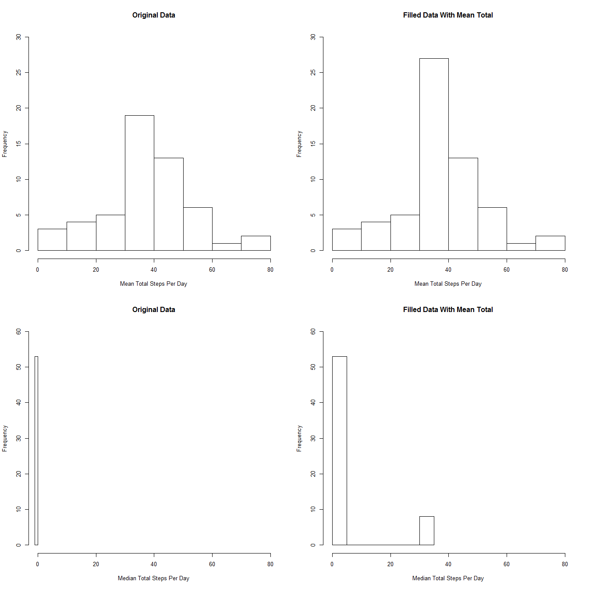

# Reproducible Research: Peer Assessment 1


## Loading and preprocessing the data
The dataset is from a personal activity monitoring device. This device collects data at 5 minute intervals through out the day. The data consists of two months of data from an anonymous individual collected during the months of October and November, 2012 and include the number of steps taken in 5 minute intervals each day.

The variables included in this dataset are:
steps: Number of steps taking in a 5-minute interval (missing values are coded as NA)
date: The date on which the measurement was taken in YYYY-MM-DD format
interval: Identifier for the 5-minute interval in which measurement was taken
The dataset is stored in a comma-separated-value (CSV) file and there are a total of 17,568 observations in this dataset.

The first step is to load the data to data frame df. The data file name is activity.csv


```r
df <- read.csv('activity.csv')

df.clean <- na.omit(df)
```


## What is mean total number of steps taken per day?
First calculate sum, mean and median by date. If no data is available for a given day, NA is used for that day.

```r
library(doBy)
df.byDay <- summaryBy(steps ~ date, data=df, FUN = list(sum, mean, median), na.rm=TRUE)
```
1. Calculate the total number of steps taken per day


```r
dfTotal.Byday <- summaryBy(steps ~ date, data=df, FUN = list(sum), na.rm=TRUE)
dfTotal.Byday
```

```
##          date steps.sum
## 1  2012-10-01         0
## 2  2012-10-02       126
## 3  2012-10-03     11352
## 4  2012-10-04     12116
## 5  2012-10-05     13294
## 6  2012-10-06     15420
## 7  2012-10-07     11015
## 8  2012-10-08         0
## 9  2012-10-09     12811
## 10 2012-10-10      9900
## 11 2012-10-11     10304
## 12 2012-10-12     17382
## 13 2012-10-13     12426
## 14 2012-10-14     15098
## 15 2012-10-15     10139
## 16 2012-10-16     15084
## 17 2012-10-17     13452
## 18 2012-10-18     10056
## 19 2012-10-19     11829
## 20 2012-10-20     10395
## 21 2012-10-21      8821
## 22 2012-10-22     13460
## 23 2012-10-23      8918
## 24 2012-10-24      8355
## 25 2012-10-25      2492
## 26 2012-10-26      6778
## 27 2012-10-27     10119
## 28 2012-10-28     11458
## 29 2012-10-29      5018
## 30 2012-10-30      9819
## 31 2012-10-31     15414
## 32 2012-11-01         0
## 33 2012-11-02     10600
## 34 2012-11-03     10571
## 35 2012-11-04         0
## 36 2012-11-05     10439
## 37 2012-11-06      8334
## 38 2012-11-07     12883
## 39 2012-11-08      3219
## 40 2012-11-09         0
## 41 2012-11-10         0
## 42 2012-11-11     12608
## 43 2012-11-12     10765
## 44 2012-11-13      7336
## 45 2012-11-14         0
## 46 2012-11-15        41
## 47 2012-11-16      5441
## 48 2012-11-17     14339
## 49 2012-11-18     15110
## 50 2012-11-19      8841
## 51 2012-11-20      4472
## 52 2012-11-21     12787
## 53 2012-11-22     20427
## 54 2012-11-23     21194
## 55 2012-11-24     14478
## 56 2012-11-25     11834
## 57 2012-11-26     11162
## 58 2012-11-27     13646
## 59 2012-11-28     10183
## 60 2012-11-29      7047
## 61 2012-11-30         0
```

```r
hist(dfTotal.Byday$steps.sum, main="Total number of steps taken per day in two months", xlab="Total Steps")
```


2. Calculate and report the mean and median total number of steps taken per day

```r
## The mean and median is calculated in df.byDate. We just need to display them
subset(df.byDay, select = c(date, steps.mean, steps.median))
```

```
##          date steps.mean steps.median
## 1  2012-10-01        NaN           NA
## 2  2012-10-02  0.4375000            0
## 3  2012-10-03 39.4166667            0
## 4  2012-10-04 42.0694444            0
## 5  2012-10-05 46.1597222            0
## 6  2012-10-06 53.5416667            0
## 7  2012-10-07 38.2465278            0
## 8  2012-10-08        NaN           NA
## 9  2012-10-09 44.4826389            0
## 10 2012-10-10 34.3750000            0
## 11 2012-10-11 35.7777778            0
## 12 2012-10-12 60.3541667            0
## 13 2012-10-13 43.1458333            0
## 14 2012-10-14 52.4236111            0
## 15 2012-10-15 35.2048611            0
## 16 2012-10-16 52.3750000            0
## 17 2012-10-17 46.7083333            0
## 18 2012-10-18 34.9166667            0
## 19 2012-10-19 41.0729167            0
## 20 2012-10-20 36.0937500            0
## 21 2012-10-21 30.6284722            0
## 22 2012-10-22 46.7361111            0
## 23 2012-10-23 30.9652778            0
## 24 2012-10-24 29.0104167            0
## 25 2012-10-25  8.6527778            0
## 26 2012-10-26 23.5347222            0
## 27 2012-10-27 35.1354167            0
## 28 2012-10-28 39.7847222            0
## 29 2012-10-29 17.4236111            0
## 30 2012-10-30 34.0937500            0
## 31 2012-10-31 53.5208333            0
## 32 2012-11-01        NaN           NA
## 33 2012-11-02 36.8055556            0
## 34 2012-11-03 36.7048611            0
## 35 2012-11-04        NaN           NA
## 36 2012-11-05 36.2465278            0
## 37 2012-11-06 28.9375000            0
## 38 2012-11-07 44.7326389            0
## 39 2012-11-08 11.1770833            0
## 40 2012-11-09        NaN           NA
## 41 2012-11-10        NaN           NA
## 42 2012-11-11 43.7777778            0
## 43 2012-11-12 37.3784722            0
## 44 2012-11-13 25.4722222            0
## 45 2012-11-14        NaN           NA
## 46 2012-11-15  0.1423611            0
## 47 2012-11-16 18.8923611            0
## 48 2012-11-17 49.7881944            0
## 49 2012-11-18 52.4652778            0
## 50 2012-11-19 30.6979167            0
## 51 2012-11-20 15.5277778            0
## 52 2012-11-21 44.3993056            0
## 53 2012-11-22 70.9270833            0
## 54 2012-11-23 73.5902778            0
## 55 2012-11-24 50.2708333            0
## 56 2012-11-25 41.0902778            0
## 57 2012-11-26 38.7569444            0
## 58 2012-11-27 47.3819444            0
## 59 2012-11-28 35.3576389            0
## 60 2012-11-29 24.4687500            0
## 61 2012-11-30        NaN           NA
```


```r
hist(df.byDay$steps.mean, main="Mean total number of steps taken per day in two months", xlab="Mean Total Steps")
```


```r
hist(df.byDay$steps.median, main="Median total number of steps taken per day in two months", xlab="Median Total Steps")
```


## What is the average daily activity pattern?
Make a time series plot (i.e. type = "l") of the 5-minute interval (x-axis) and the average number of steps taken, averaged across all days (y-axis)

```r
df.byInterval <- summaryBy(steps ~ interval, data=df, FUN = list(mean), na.rm=TRUE)
plot(df.byInterval$interval,df.byInterval$steps.mean,type = "l", main = "Average number of steps taken by Interval", xlab = "Interval", ylab = "Average Steps")
```


```r
df.max <- df.byInterval[df.byInterval$steps.mean == max(df.byInterval$steps.mean),]
```
The 5-minute interval "835" , on average across all the days in the dataset, contains the maximum number of steps 206

## Imputing missing values
There are a number of days/intervals where there are missing values (coded as NA). The presence of missing days may introduce bias into some calculations or summaries of the data.

1. Calculate and report the total number of missing values in the dataset (i.e. the total number of rows with NAs)

```r
NaCount <- sum(is.na(df$steps))
```
There are 2304 missing values in the dataset

2. Devise a strategy for filling in all of the missing values in the dataset. The strategy does not need to be sophisticated. For example, you could use the mean/median for that day, or the mean for that 5-minute interval, etc.

The missing values will be filled with the mean for that day. For the days that have no data, the missing data will be filled with mean of that interval.

3. Create a new dataset that is equal to the original dataset but with the missing data filled in.
Two new datasets are created with the missing data filled in with mean and median values for that data.

```r
library(zoo)
## filling missing data with mean for that day
dfNewMean <- transform(df, steps_new = na.aggregate(steps, by=date, FUN = mean))
dfNewMean <- transform(dfNewMean, steps_new = na.aggregate(steps, by=interval, FUN = mean))

## filling missing data with median for that day
dfNewMedian <- transform(df, steps_new = na.aggregate(steps, by=date, FUN = median))
dfNewMedian <- transform(dfNewMedian, steps_new = na.aggregate(steps, by=interval, FUN = median))
```

4. Make a histogram of the total number of steps taken each day and Calculate and report the mean and median total number of steps taken per day. Do these values differ from the estimates from the first part of the assignment? What is the impact of imputing missing data on the estimates of the total daily number of steps?

a histogram of the total number of steps taken each day 

```r
dfNewTotal.byDay <- summaryBy(steps_new ~ date, data=dfNewMean, FUN = list(sum))
hist(dfNewTotal.byDay$steps_new.sum, main="Total number of steps taken per day (with Filled Data)", xlab="Total Steps")
```


As shown in the graph below, after filling in missing data with mean values for that day, only the mean total step between 30 to 40 increases. The median values are also changes.

```r
dfNewMean.byDay <- summaryBy(steps_new ~ date, data=dfNewMean, FUN = list(mean))
dfNewMedian.byDay <- summaryBy(steps_new ~ date, data=dfNewMean, FUN = list(median))

##plot two histograms to compare the original data vs filled data
par(mfrow=c(2,2))
hist(df.byDay$steps.mean, xlim=c(0, 80), ylim=c(0, 30), main="Original Data", xlab = "Mean Total Steps Per Day")
hist(dfNewMean.byDay$steps_new.mean, xlim=c(0, 80), ylim=c(0, 30), main="Filled Data With Mean Total", xlab = "Mean Total Steps Per Day")
hist(df.byDay$steps.median, xlim=c(0, 80), ylim=c(0, 60), main="Original Data", xlab = "Median Total Steps Per Day")
hist(dfNewMedian.byDay$steps_new.median, xlim=c(0, 80), ylim=c(0, 60), main="Filled Data With Mean Total", xlab = "Median Total Steps Per Day")
```



As shown in the graph below, after filling in missing data with median values for that day, the mean total step between 0 to 10 increases. The frequency of median values 0 is also increases.

```r
dfNewMean.byDay <- summaryBy(steps_new ~ date, data=dfNewMedian, FUN = list(mean))
dfNewMedian.byDay <- summaryBy(steps_new ~ date, data=dfNewMedian, FUN = list(median))

##plot two histograms to compare the original data vs filled data
par(mfrow=c(2,2))
hist(df.byDay$steps.mean, xlim=c(0, 80), ylim=c(0, 30), main="Original Data", xlab = "Mean Total Steps Per Day")
hist(dfNewMean.byDay$steps_new.mean, xlim=c(0, 80), ylim=c(0, 30), main="Filled Data With Median Total", xlab = "Mean Total Steps Per Day")
hist(df.byDay$steps.median, xlim=c(0, 80), ylim=c(0, 60), main="Original Data", xlab = "Median Total Steps Per Day")
hist(dfNewMedian.byDay$steps_new.median, xlim=c(0, 80), ylim=c(0, 60), main="Filled Data With Median Total", xlab = "Median Total Steps Per Day")
```


## Are there differences in activity patterns between weekdays and weekends?
1. Create a new factor variable in the dataset with two levels -- "weekday" and "weekend" indicating whether a given date is a weekday or weekend day.

```r
library(plyr)

dfNewMean$week <-ifelse(weekdays(as.Date(dfNewMean$date)) %in% c("Saturday","Sunday"), "Weekend","weekday")

dfNewMean.week <- subset(dfNewMean, select = c(interval, week, steps_new))

dfNewMean.byInterval <- ddply(dfNewMean.week, .(week, interval), numcolwise(mean))
```

2. Make a panel plot containing a time series plot (i.e. type = "l") of the 5-minute interval (x-axis) and the average number of steps taken, averaged across all weekday days or weekend days (y-axis).

```r
library(lattice)
xyplot(steps_new ~ interval | week, dfNewMean.byInterval, type = "l",layout=c(1,2), ylab = "Number of Steps")
```


